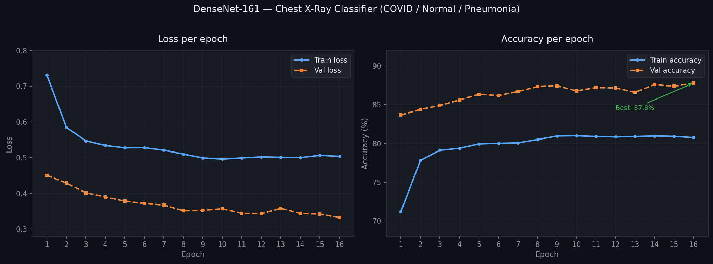

# Chest X-Ray Classifier

A deep learning model that classifies chest X-ray images into three categories:

| Class | Description |
|-------|-------------|
| **COVID-19** | X-rays showing COVID-19 pneumonia patterns |
| **Pneumonia** | X-rays showing bacterial/viral pneumonia |
| **Normal** | Healthy chest X-rays |

Built with **PyTorch** and a fine-tuned **DenseNet-161** backbone pretrained on ImageNet.

---
## Download the model

> 📥 [Download SL.h5 — Google Drive](https://drive.google.com/file/d/1ZsJ-8Uu30M3lg4SEynHYnq1n72fL2NqC/view?usp=drive_link)

Place it at:
```
model/SL.h5
```
## Project Structure

```
chest-xray-classifier/
├── src/
│   ├── train.py        # Training pipeline
│   └── predict.py      # Single-image inference
├── saved_models/       # Saved .pth model files (not tracked by Git)
├── results/            # Training curves and metrics (not tracked by Git)
├── requirements.txt
└── README.md
```

---

## Setup

```bash
git clone https://github.com/Momo-0/chest-xray-classifier.git
cd chest-xray-classifier
pip install -r requirements.txt
```

---

## Dataset Structure

Organize your dataset as follows:

```
data_dir/
├── train/
│   ├── COVID/
│   ├── Normal/
│   └── Pneumonia/
└── test/
    ├── COVID/
    ├── Normal/
    └── Pneumonia/
```

> Recommended dataset: [COVID-19 Radiography Database](https://www.kaggle.com/datasets/tawsifurrahman/covid19-radiography-database) on Kaggle.

---

## Training

Edit the configuration at the bottom of `src/train.py`:

```python
DATA_DIR   = '/path/to/your/dataset'
BATCH_SIZE = 32
NUM_EPOCHS = 25
LR         = 0.001
```

Then run:

```bash
python src/train.py
```
## Training Curves (16 Epochs)


Training will:
- Fine-tune the DenseNet-161 classifier head (backbone is frozen)
- Save the best model weights to `saved_models/`
- Save training metrics to `results/training_results.h5`
- Plot and save training curves to `results/training_curves.png`

---

## Inference

Run inference on a single X-ray image:

```bash
python src/predict.py /path/to/xray.png
```

Example output:

```
Image      : /path/to/xray.png
Prediction : COVID
Confidence : 94.73%

Class probabilities:
  COVID        94.73%  ████████████████████████████
  Normal        3.12%  █
  Pneumonia     2.15%  
```

Or use it as a module:

```python
from src.predict import predict

result = predict(
    image_path  = 'xray.png',
    model_path  = 'saved_models/best_model.pth',
    data_dir    = '/path/to/dataset'
)

print(result['predicted_class'])   # e.g. 'COVID'
print(result['confidence'])        # e.g. 0.9473
print(result['all_probs'])         # {'COVID': 0.9473, 'Normal': 0.0312, ...}
```

---

## Model Architecture

| Component | Detail |
|-----------|--------|
| Backbone | DenseNet-161 (pretrained on ImageNet) |
| Classifier | Linear layer → 3 output classes |
| Input size | 224 × 224 RGB |
| Optimizer | Adam (lr = 0.001) |
| Loss | CrossEntropyLoss |
| Training strategy | Transfer learning — backbone frozen, only classifier head trained |

---

## Requirements

- Python 3.8+
- CUDA-compatible GPU (recommended for training)
- See `requirements.txt` for full dependencies

---

## License

MIT License — free to use, modify, and distribute.
